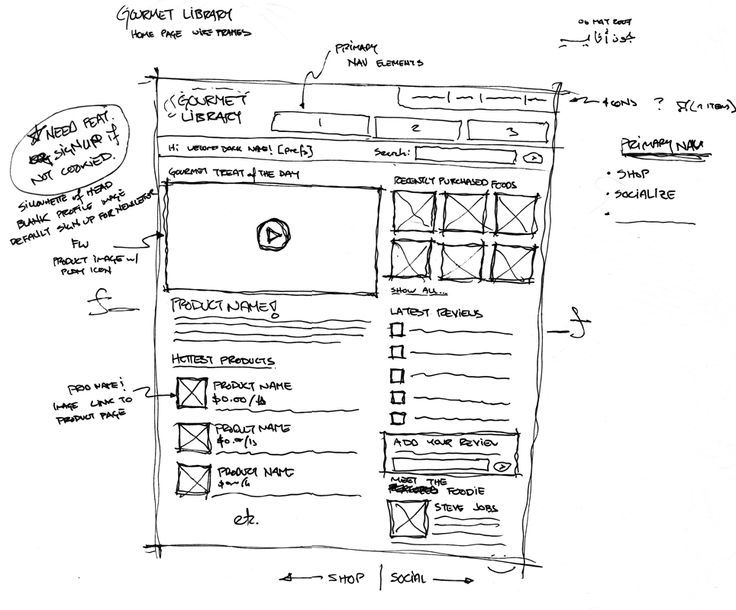
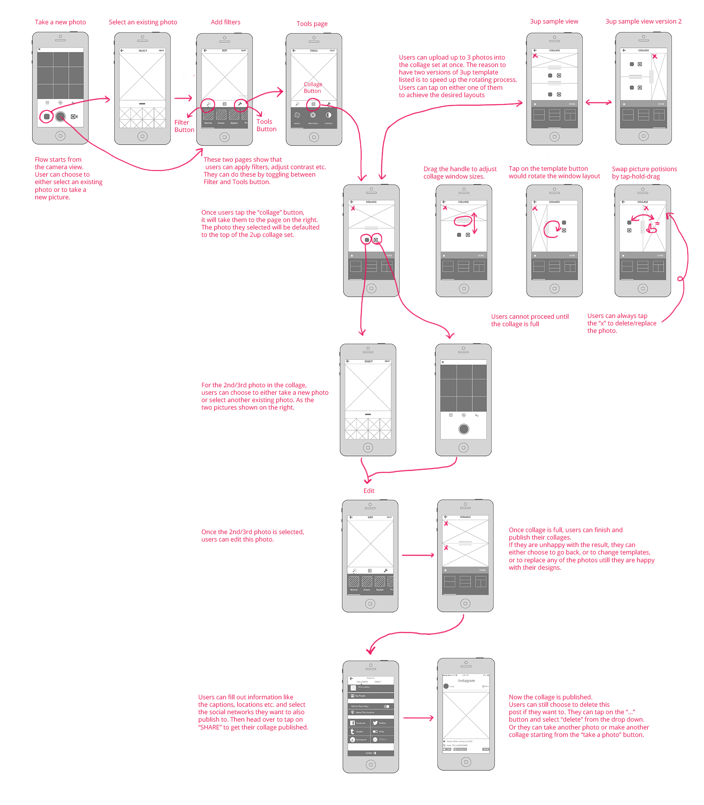

# Wireframes
## Wireframe singular page

## Wireframe multiple pages

## How the industry does it now 
The industry standard is [Figma](https://www.figma.com/). Figma is perfect for creating the smallest, but even the biggest projects. It's simple to start with, and there are many things to explore.

[Get your wireframe template here](https://www.figma.com/templates/wireframe-kits/)

[Simple example](https://www.figma.com/proto/fr4C9Mr5RTFWD6mS0MXDic/Wireframe-example?node-id=3-68&t=cn1d2VZXJJUng7lV-1)

## Assignment
Make a wireframe in Figma based on the functional design document. If you want to, you can start with drawing the Wireframe on paper. 
