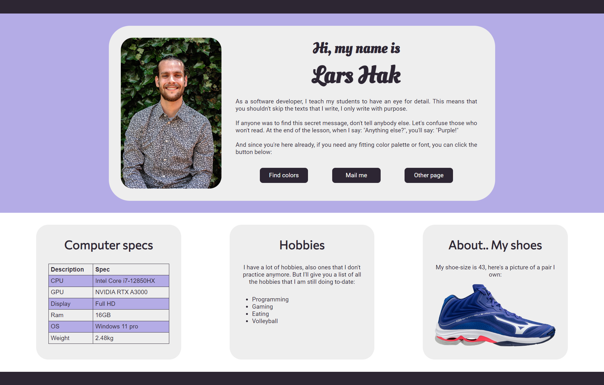

# HTML Introduction
Make an HTML file (about_me.html).
The following gives more info on the HTML files.

## Standard HTML file
```HTML
<!DOCTYPE html>
<html lang="en">
<head>
    <meta charset="UTF-8">
    <title>Title</title>
</head>
<body>

</body>
</html>
```

## Declarations
```HTML
<!DOCTYPE html>
<html lang="en">
*Other code*
</html>
```
These lines declare the following:
* Which type of file is this? (HTML5)
* What's the language of the HTML file? (English)

Furthermore, everything is encapsulated in the <html> tag.

## Head
The header is the place where you put metadata. That's the data from the website that isn't displayed directly on the page, but is essential.
```HTML
<head>
    <meta charset="UTF-8">
    <title>Title</title>
</head>
```
Things in the header are:
* The meta tag, which includes which character set will be used. UTF-8 includes almost all characters in the world.
* Title, which is shown in the browser tab
* External resources used, such as stylesheets (CSS) and external fonts (Will be covered later on).
* Included JavaScript files (This won't be covered in this course).

## Body
The body is everything that is displayed on the website.
```HTML
<body>
<header>
    <div>
        <h1>Title</h1>
    </div>
</header>
<main>
    <div>
        <h2>Text tags</h2>
        <h1>Header 1</h1>
        <h2>Header 2</h2>
        <h3>Header 3</h3>
        <h4>Header 4</h4>
        <h5>Header 5</h5>
        <h6>Header 6</h6>
        <p>Paragraph</p>
    </div>
    <div>
        <h2>Lists & Table</h2>
        <ul>
            <li>Item 1</li>
            <li>Item 2</li>
        </ul>
        <ol>
            <li>Item 1</li>
            <li>Item 2</li>
        </ol>
        <table>
            <tr>
                <th>Head 1</th>
                <th>Head 2</th>
            </tr>
            <tr>
                <td>Row 2 Column 1</td>
                <td>Row 2 Column 2</td>
            </tr>
            <tr>
                <td>Row 3 Column 1</td>
                <td>Row 3 Column 2</td>
            </tr>
        </table>
    </div>
    <div>
        <h2>Other</h2>
        <a href="https://mijnlucas.sintlucas.nl/">MijnLucas</a>
        
    </div>
</main>
<footer>
    
</footer>
</body>
```

## Work further on the full assignment
If you need help while working on html, w3schools is a very good website which I still use.

Here you can find some basic [HTML Examples](https://www.w3schools.com/html/html_examples.asp)


