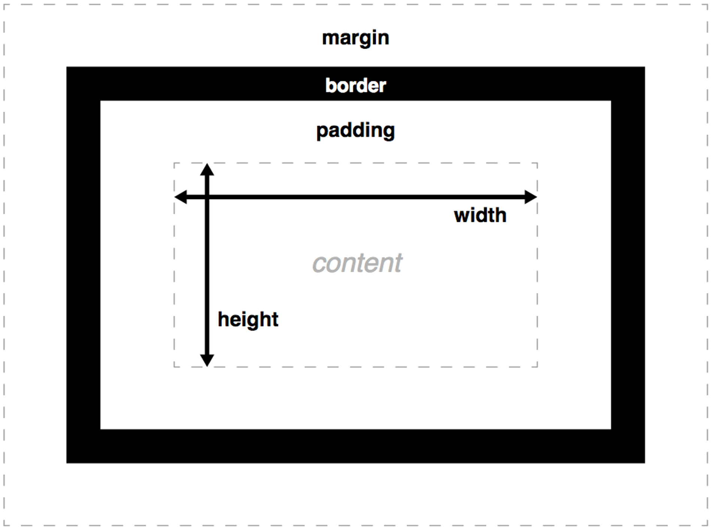

# CSS Intro

## Add your stylesheet
Make a stylesheet (main.css) and put the following code in it.
```CSS
img{
    width: 50vw;
}
a:hover{
    color: red;
}
.title{
    font-size: 3vw;
    font-style: italic;
}
```

Use the stylesheet by including it in the head of the HTML file
```HTML
<link rel="stylesheet" href="main.css">
```

## Class elements
The h1 (element selector) and a:hover (pseudo-class) did something, but how do you use .title?

If we connect a class element to the HTML element, it will be used.

The class element will overwrite the element selector. So if h1 is normally 2vw, but your class is 4vw, the size will be 4vw.

```HTML
<h1 class="title">Title</h1>
```

## How to style
So now we know how to connect styles to specific elements. We don't know how to style, since we don't know what we can do.

In the same way as the HTML Examples there's all kinds of [CSS Examples](https://www.w3schools.com/css/css_examples.asp) online

### Options you have in CSS
There's all kinds of properties you can change with CSS, here's a few that are very common:
* font-size, changes the size of the text.
* font-family, changes the font you use.
* color, changes the color of the text.
* background-color, changes the background color of the element.
* border, adds a border to the element.
* width/height, changes dimensions of the element.
* margin, the space around an element.
* padding, the space between the borders of the element, but around the content.
* position, static, relative, absolute, fixed, sticky (Will be explained in the next lesson).



### Sizing
If we want to size divs, text or anything else, we can use the following values:
* px is a set value based on the size of a standard pixel, it's an absolute length (doesn't change size when you change screens sizes).
* vw is view width, which means that it will scale with the width of your window (1vw is 1% of the width of the screen).
* % is relative to the parent object. A width of 50% means that it's 50% of the parent div (1% is 1% of the dimension of the parent object).


